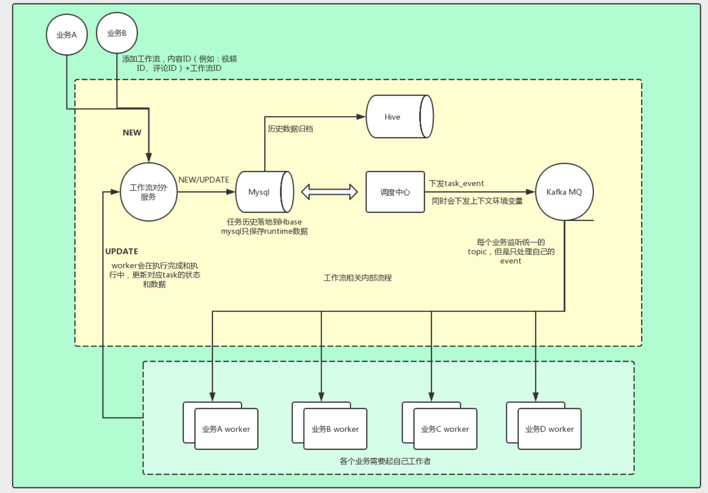

# Termite

Termite是一个轻量级流程调度系统, 它只实现了任务调度的Server, 使用者定义自己的TaskOperator, 通过kafka顺序的下发消息来实现任务按照指定的顺序执行, 任务的执行状态通过rpc来上报给termite。Termite适用于面向对象处理的流式计算，创建的每一个工作流实例都必须指定一个Object Id。

**工作(work):**  任务执行的最小粒度

**工作流(workflow):**  任务流执行配置及多个任务间的依赖关系




### Deploy

---

依赖mysql, kafka, redis基础服务，使用docker进行程序打包，使用compose做服务编排。

1. 创建数据库: [db.sql](./resource/db.sql)
2. 编译打包
>  + 前端: cd web && cnpm run build
>  + 后端: make 
>  + Dockerfile
```yaml
FROM github-harbor/golang:with-ffmpeg
ADD ${CI_PROJECT_NAME}_server /data/service
ADD ${CI_PROJECT_NAME}_cron /data/service
ADD ${CI_PROJECT_NAME}_scheduler /data/service
ADD ${CI_PROJECT_NAME}_http /data/service
ADD . /data/service
```
3. 编排文件: [docker-compose.yml](./resource/docker-compose.yml)

```yaml
services:
  serv:
    command:
      - startup
      - "./termite_server"  # Rpc服务, 工作流创建&重试, 工作执行&成功&失败&异常&延期
    ...
  cron:
    command:
      - startup
      - "./termite_cron"  # 节点分区管理, 系统监控检查, 任务超时检查
    ...
  http:
    command:
      - startup
      - "./termite_server"  # Http服务, web, 配置管理接口，实例管理接口, 系统info接口
    ...
  dag_scheduler:
    command:
      - startup
      - "./termite_scheduler dag"  # Dag任务调度
    ...
  delay_scheduler:
    command:
      - startup
      - "./termite_scheduler delay"  #  延期任务调度
    ...
  align_scheduler:
    command:
      - startup
      - "./termite_scheduler align"  #  工作&工作流状态同步
    ...

```


### Constraint & Feature

---

+ Client自定义执行器
> termtie服务只进行任务的调度，不定义任务如何执行，约定好key之后通过kafka消息进行任务触发,Client自己定义Operator。
+ Client中task实现需要幂等性
> 存在各种情况会使得任务重复执行，task的实现保证多次执行不影响结果。
+ 支持工作流平滑升级 
> 工作流配置更新后，支持依据旧配置创建的实例调度完成。
+ 支持限量调度&调度模式 
> 正常情况下，工作流是均匀的创建的，但可能出现批量处理一批数据的情况，Termite支持限制并行调度数量

> 调度模式支持: FIFO(先进先出) LIFO(后进先出)
+ 支持错误传递
> 任务执行异常或失败信息通知Termite便于查看
+ 提供Web页面
> 工作配置、工作流配置、配置可视化、工作流实例管理、工作流实例创建
+ 支持工作流调度开关
+ 支持监控报警
> 接入钉钉
+ 支持多接点调度
+ 支持失败重试&超时重试
> + 任务失败重试确保每个任务只重试一次
> + 任务超时分为任务下发超时和任务执行超时，可以为每个工作流配置任务超时时间，任务下发超时检测需要增加保护机制，避免因为下游任务积压而导致任务重复执行。
+ 支持工作流和工作配置其他参数


### Issues

---

+ *两个SetContext请求并发时其中一个会失效*
> 使用redis setnx作独占锁
+ *怎么才是真正的超时?* 
> 任务积压不算超时 

> PushTimeout:同一个work后push的任务running了先push超时 

> RunningTimeout: client书写不规范可能导致假超时
+ *fatal error:concurrent map read and map write*
> map拷贝替换

### Todo

---

+ flow平均调度时间
+ retryLimits retryBackoff 配置

### Example

使用python作为Client程序

1. 配置工作及工作流

```json
{
    "works": [
        "video_encode_submit_task",
        "video_encode_trace_task"
    ],
    "dags": {
        "video_encode_trace_task": {
            "dependences": [
                "video_encode_submit_task"
            ],
            "trigger_rule": "all_success"
        }
    },
    "max_scheduler_count": 1000,
    "scheduler_mode": "fifo"
}
```

2. 任务事件Consumer 

```python
c = Consumer({
    "bootstrap.servers": KAFKA_HOST,
    'group.id': group,
})
c.subscribe([KAFKA_TOPIC])
while True:
    msg = c.poll(1)
    if msg is None:
        continue
    if not msg.error():
        data = json.loads(msg.value())
        kwargs = {
            "work_id": data["Work_id"],
            "flow_id": data["Flow_id"],
            "cid": data["Cid"]
        }
        if data.get("Work", "") == "video_encode_submit_task":
            tasks.video_encode_submit_task.delay(**kwargs)
        else:
            pass
c.close()
```

3. Celery Task

```python

import functools

def termite(func):
    @functools.wraps(func)
    def wrapper(*args, **kwargs):
        r, r_info = m.start_work(work_id=kwargs["work_id"])
        if r != 1:
            return
        try:
            func(*args, **kwargs)
        except Exception as e:
            if settings.DEBUG:
                traceback.print_exc()
            m.raise_work(kwargs["work_id"], traceback.format_exc())
    return wrapper

from operation_content.celery import app

@app.task()
@termite
def video_encode_submit_task(*args, **kwargs):
    """ 视频转码提交任务 """

    # 具体业务逻辑
    m.finish_work(work_id=kwargs["work_id"])
    return
```


---


